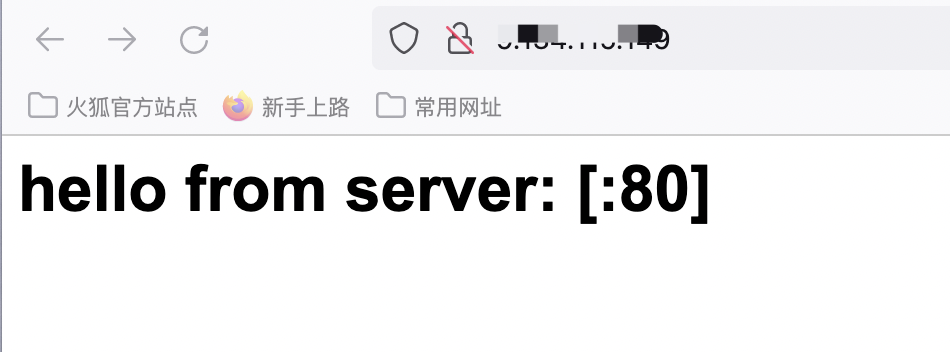
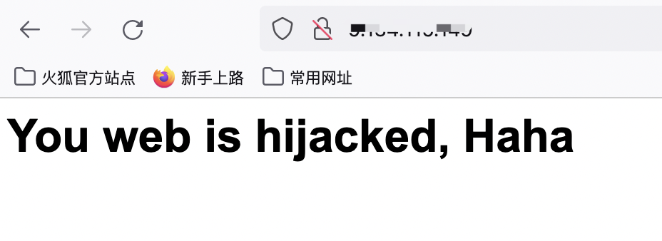

## gofake

<div align="center">
  <h1><code>raw_proxy</code></h1>
  <p>
    <a href="https://img.shields.io/badge/version-1.0.0-blue" alt="version">
      
    </a>
    <a href="https://img.shields.io/badge/license-Apache-brightgreen" alt="Apache">
      
    </a>
  </p>
  <p>
    <strong>http流量劫持</strong>
  </p>
</div>

## 目录  
- [介绍](#介绍)  
- [编译](#编译)  
- [效果](#效果)  

##  介绍 

用gopacket 实现http流量劫持，代码寥寥，甚是简洁  

## 编译  
```shell
go mod tidy
go build
sudo ./gofake
```

## 效果  
- 劫持前  
 

- 劫持后  
 


